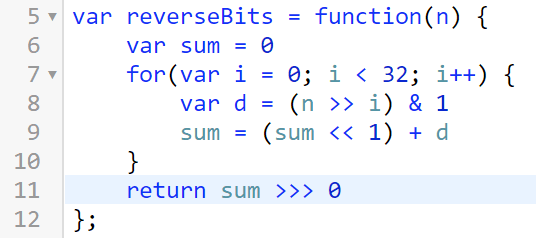

# Point

## 问题

- 7: 输入一个数，输出其是否是 7 的倍数或各个位上是否有 7（25：NO，27：YES，21：YES)
- sort: 输入 3 个数，按从小到大顺序输出
- narcissistic: 输入一个数判断其是否为水仙花数，输出"YES"/"NO"
- narcissistics: 输出 1000 以内的水仙花数
- palindrom: 输入一个数，判断其是否为一个一个回文数"YES"/"NO"
- weekday: 输入年份与月份，输出这此年此月的第一天为星期几（0 对应周日，1 对应周一）
- complete-number: 输入一个数判断其是否为完数，输出"YES"/"NO"
- complete-numbers: 输出 1000 以内的完数
- prime: 输入一个数判断其是否为素数数，输出"YES"/"NO"
- primes: 输出 100 以内的素数
- itob: 输入一个数，输出其字符串形式
- lcf&lcm: 输入两个数，分别输出它们的最大公约数和最小公倍数
- sqrt: 输入一个数，输出其平方根，精确到小数点后 3 位
- 使用优化算法计算 a 的 n 次方, 即当 n 为偶数时, 只需要计算 a 的 n/2 次方后再平方一次即可, 当 n 为奇数时，计算 a 的(n-1)/2 次方的值平方后再乘以 a 即可, 依次类推.

## 解答

```js
var q = +prompt();
var isEm = prompt();

var p = 8;

if (q > 1000) {
  p += Math.ceil((q - 1000) / 500) * 4;
}

if (isEm === "y") {
  p += 5;
}

console.log(p);

if (isEm == "y") {
  if (q < 1000) {
  } else {
  }
} else {
  if (q > 1000) {
  } else {
  }
}

if (q < 1000 && isEm == "n") {
} else if (q > 1000 && isEm == "n") {
} else if (q < 1000 && isEm == "y") {
} else if (q > 1000 && isEm == "y") {
}
```

```js
var n = +prompt();
var age;
var sum = 0;

for (var i = 0; i < n; i++) {
  age = +prompt();
  sum = sum + age;
}

console.log(sum / n);
```

```js
var n = +prompt();
var max = -Infinity;
var min = Infinity;

for (var i = 0; i < n; i++) {
  score = +prompt();
  if (score > max) {
    max = score;
  }
  if (score < min) {
    min = score;
  }
}

console.log(max - min);
```

```js
var n = +prompt();
var max = -Infinity;
var min = Infinity;
debugger;
for (var i = 0; i < n; i++) {
  score = +prompt();
  if (score > max) {
    max = score;
  }
  if (score < min) {
    min = score;
  }
}

console.log(max - min);
```

```js
var n = +prompt();
var c1 = 0;
var c5 = 0;
var c10 = 0;

for (var i = 0; i < n; i++) {
  var x = +prompt();
  if (x == 1) {
    c1++;
  }
  if (x == 5) {
    c5++;
  }
  if (x == 10) {
    c10++;
  }
}

console.log(c1, c5, c10);
```

```js
var a = 1;
var b = 1;

var n = 5;

for (var i = 0; i < n; i++) {
  b = b + a;
  a = b - a;
}

console.log(b);
```

```js
var n = +prompt();
var count = 0;

for (var i = 0; i < n; i++) {
  var number = +prompt();

  var last = number % 10;
  number = (number - last) / 10;

  while (number > 0) {
    var digit = number % 10;
    last -= digit;
    if (last < 0) {
      break;
    }
    number = (number - digit) / 10;
  }

  if (last > 0) {
    count++;
  }
}

console.log(count);

// ch0105/26升级版
```

```js
var n = +prompt();
var sign = n > 0 ? 1 : -1;
n = Math.abs(n);
var sum = 0;

while (n > 0) {
  var digit = n % 10;
  sum = sum * 10 + digit;
  n = (n - digit) / 10;
}

console.log(sign * sum);

// ch0105/29

var n = +prompt();
var sum = 0;

while (n != 0) {
  var digit = n % 10;
  sum = sum * 10 + digit;
  n = (n - digit) / 10;
}

console.log(sum);
```

```js
var n = +prompt();
var k = +prompt();

if (n % 19 == 0) {
  while (n > 0) {
    var digit = n % 10;
    if (digit === 3) {
      k--;
    }
    n = (n - digit) / 10;
  }
  if (k == 0) {
    console.log("YES");
  } else {
    console.log("NO");
  }
} else {
  console.log("NO");
}
/* 0105/30 */
```

```js
var n = +prompt();
var m = +prompt();

for (var light = 1; light <= n; light++) {
  var isLightOn = true;

  for (var p = 1; p <= m; p++) {
    if (light % p == 0) {
      isLightOn = !isLightOn;
    }
  }

  if (!isLightOn) {
    console.log(light);
  }
}
//105.31
```

```js
var n = +prompt();

var a = 1;
var b = 1;
var sum = 0;

for (var i = 0; i < n; i++) {
  b = b + a;
  a = b - a;
  sum += b / a;
  console.log(b / a);
}

console.log(sum);
//105.32
```

```js
var n = +prompt();
var result = 0;

for (var i = 1; i <= n; i++) {
  var fac = 1;

  for (var j = 1; j <= i; j++) {
    fac *= j;
  }

  result += fac;
}

console.log(result);
//105.34
```

```js
var result = 0;

for (var i = 1; i <= 21; i++) {
  if (i % 7 != 0) {
    var n = i;
    while (n > 0) {
      var digit = n % 10;
      if (digit == 7) {
        break;
      }
      n = (n - digit) / 10;
    }
    if (n == 0) {
      result += i * i;
    }
  }
}

console.log(result);
//105.39
```

```js
var n = 6;

var give = 1;
var sum = 0;

for (var i = 0, j = 0; i < n; j++, i++) {
  if (j == give) {
    j = 0;
    give++;
  }
  sum += give;
}

console.log(sum);
//105.45
```

```js
var isRelatedWith7 = function(n) {
  if (n % 7 == 0) {
    return true;
  } else {
    while (n > 0) {
      var digit = n % 10;
      if (digit == 7) {
        return true;
      }
      n = (n - digit) / 10;
    }
    return false;
  }
};

var getNumber = function(hint) {
  return +prompt(hint);
};

var num = getNumber("请输入");

if (isRelatedWith7(num)) {
  console.log("YES");
} else {
  console.log("NO");
}
```

```js
var isPrime = function(n) {
  if (n < 2) {
    return false;
  }

  var sqrt_n = Math.floor(Math.sqrt(n));

  for (var i = 2; i <= sqrt_n; i++) {
    if (n % i == 0) {
      return false;
    }
  }

  return true;
};
```

```js
for (var i = 1; i < 10000; i++) {
  var n = i;
  var m = n;
  // 153
  var width = 0;

  while (m > 0) {
    width++;
    var digit = m % 10;
    m = (m - digit) / 10;
  }

  m = n;

  var sum = 0;
  while (m > 0) {
    var digit = m % 10;
    var product = 1;
    for (var i = 0; i < width; i++) {
      product *= digit;
    }
    sum += product;
    m = (m - digit) / 10;
  }

  if (sum == n) {
    console.log(n);
  } else {
    //console.log('NO')
  }
}
```

```js
/**
 * 返回数值m在十进制下的位宽
 */
var getDigitWidth = function(m) {
  var width = 0;
  if (m == 0) {
    return 1;
  }
  while (m > 0) {
    width++;
    var digit = m % 10;
    m = (m - digit) / 10;
  }
  return width;
};

/**
 * 返回a的n次方，n为整数
 */
var power = function(a, n) {
  var result = 1;

  for (var i = 0; i < n; i++) {
    result *= a;
  }

  return result;
};

/**
 * 判断数值n是否为一个水仙花数
 */
var isNarcissistic = function(n) {
  var width = getDigitWidth(n);
  var m = n;

  var sum = 0;

  while (n > 0) {
    var digit = n % 10;
    sum += power(digit, width);
    n = (n - digit) / 10;
  }

  if (sum == m) {
    return true;
  }
  return false;
};

var printNarcissisticsBelow10000 = function() {
  for (var i = 1; i < 10000; i++) {
    if (isNarcissistic(i)) {
      console.log(i);
    }
  }
};

printNarcissisticsBelow10000();
```

```js
var isPalindrom = function(n) {
  var width = getDigitWidth(n);

  for (var i = 1; i <= n / 2; i++) {
    var right = Math.floor(n / power(10, i - 1)) % 10;
    var left = Math.floor(n / power(10, width - i)) % 10;

    if (right !== left) {
      return false;
    }
  }

  return true;
};

var isPalindrom2 = function(n) {
  var sum = 0;
  var m = n;

  while (n > 0) {
    var digit = n % 10;
    sum = sum * 10 + digit;
    n = (n - digit) / 10;
  }

  return sum == m;
};
```

```js
var isCompleteNumer = function(n) {
  var sum = 1;

  var sqrt_n = Math.floor(Math.sqrt(n));

  for (var i = 2; i <= sqrt_n; i++) {
    if (n % i == 0) {
      if (i == n / i) {
        //平方根
        sum += i;
      } else {
        //非平方根
        sum += i + n / i;
      }
    }
  }

  return sum == n;
};

var isCompleteNumer3 = function(n) {
  var sum = 1;

  var sqrt_n = Math.floor(Math.sqrt(n));

  for (var i = 2; i < sqrt_n; i++) {
    if (n % i == 0) {
      sum += i + n / i;
    }
  }

  if (sqrt_n * sqrt_n == n && sqrt_n !== n) {
    sum += sqrt_n;
  }

  return sum == n;
};

var isCompleteNumer2 = function(n) {
  var sum = 1;

  for (var i = 2; i < n; i++) {
    if (n % i == 0) {
      sum += i;
    }
  }

  return sum == n;
};
```

```js
//计算z的二进制形式中1的个数
z = z & (z - 1) z !== 0
z & (z - 1) === 0 z
//能被 2**n 整除

//happy number
```

#### 6-19

```js
for (var a = 0; a < 7; a++) {
  for (var b = 0; b < 7; b++) {
    for (var c = 0; c < 7; c++) {
      var base7 = a * 49 + b * 7 + c;
      var base9 = c * 81 + b * 9 + a;
      if (base9 == base7) {
        console.log(base7, "" + a + b + c, "" + c + b + a);
      }
    }
  }
}
```

```js
function getCharFromDigit(n) {
  switch (digit) {
    case 0:
      return "0";
    case 1:
      return "1";
    case 2:
      return "2";
    case 3:
      return "3";
    case 4:
      return "4";
    case 5:
      return "5";
    case 6:
      return "6";
    case 7:
      return "7";
    case 8:
      return "8";
    case 9:
      return "9";
  }
}

function itob(n) {
  var str = "";

  while (n > 0) {
    var digit = n % 10;
    str = str + getCharFromDigit(n);
    n = (n - digit) / 10;
  }

  return str;
}
```

#### 6-25

```js
class Solution:
    def isUgly(self, num: int) -> bool:
        if num < 1:
            return False
        return 3046798700052480000000000000 % num == 0
```

```js
var myPow = function(x, n) {
  if (n == 0) {
    return 1;
  }

  if (n % 2 == 0) {
    var t = myPow(x, n / 2);
    return t * t;
  } else {
    var t = myPow(x, (n - 1) / 2);
    return t * t * x;
  }
};
```

```js
var myPow = function(x, n) {
  var digitWidth = Math.floor(Math.log2(n));
  var t = 1;

  while (digitWidth >= 0) {
    var d = (n >> digitWidth) % 2;
    if (d == 1) {
      t = t * t * x;
    } else {
      t = t * t;
    }
    digitWidth--;
  }

  return t;
};
```

```js
var myPow = function(x, n) {
    var result = 1
    var t = x
    var m = 1
    while (n > 0) {
        if (m * 2 <= n) {
            t = t * t
            m = m * 2
        } else {
            result *= t
            n = n - m
            t = x
            m = 1
        }
    }
return result
};
12:03:26.346
```

```js
function myPow(x, n) {
  var t = x;
  var r = 1;

  while (n > 0) {
    var d = n % 2;
    if (d) {
      r *= t;
    }
    t = t * t;
    n = n >> 1;
  }

  return r;
}
```

```js
var singleNumber = function(nums) {
  var seen = [];
  for (var i = 0; i < nums.length; i++) {
    var num = nums[i];
    var idx = seen.indexOf(num);
    if (idx >= 0) {
      seen.splice(idx, 1);
    } else {
      seen.push(num);
    }
  }
  return seen[0];
};
```

```js
var countPrimes = function(n) {
  var count = 0;
  for (var i = 1; i < n; i++) {
    if (isPrime(i)) {
      count++;
    }
  }
  return count;
};

var primeList = [2];

function isPrime(n) {
  if (n < 2) {
    return false;
  }

  var sqrt_n = Math.floor(Math.sqrt(n));

  for (var i = 0; primeList[i] <= sqrt_n; i++) {
    if (n % primeList[i] == 0) {
      return false;
    }
  }
  if (n > primeList[primeList.length - 1]) {
    primeList.push(n);
  }
  return true;
}
```

```js
var countPrimes = function(n) {
  if (n < 2) {
    return 0;
  }
  var flags = [];
  for (var i = 0; i < n; i++) {
    flags[i] = 1;
  }

  var sqrt_n = Math.floor(Math.sqrt(n));

  for (var i = 2; i <= sqrt_n; i++) {
    if (flags[i]) {
      var step = i % 2 ? i * 2 : i;
      for (var j = i * i; j < n; j += step) {
        flags[j] = 0;
      }
    }
  }

  var count = 0;
  for (var i = 2; i < n; i++) {
    count += flags[i];
  }
  return count;
};
```

#### 6-27

```js
function missingNumber(nums) {
  var l = nums.length + 1;
  var flags = [];

  for (var i = 0; i < l; i++) {
    flags[i] = 0;
  }

  for (var i = 0; i < nums.length; i++) {
    flags[nums[i]] = 1;
  }

  for (var i = 0; i < l; i++) {
    if (flags[i] == 0) {
      return i;
    }
  }
}
```

#### 6-28

```js
function findSolution(target) {
  var solutions = [];

  function find2(start, history) {
    if (start == target) {
      solutions.push(history);
    } else if (start < target) {
      find2(start + 1, history + " + 1");
      find2(start * 3, "(" + history + ") * 3");
    }
  }

  find2(1, "1");
  return solutions;
}

findSolution(25);
```

```js
function findSolution(target) {
  var result = [];

  function find2(start, history) {
    if (start == target) {
      result.push(history);
    } else if (start < target) {
      find2(start + 1, history + "一步 ");
      find2(start + 2, history + "两步 ");
    }
  }

  find2(0, "");
  return result;
}
```

```js
function findSolution(x, y) {
  var result = [];

  function find2(startx, starty, history) {
    if (startx == x && starty == y) {
      result.push(history);
    } else if (startx < x && starty < y) {
      find2(startx + 1, starty, history + "->");
      find2(startx, starty + 1, history + "A");
    }
  }

  find2(0, 0, "");
  return result;
}
```

```js
function weekday(year, month) {
  var days = 0
  for(var y = 1; y < year; y++) {
    if (isLeapYear(y)) {
      days += 366
    } else {
      days += 365
    }
  }

  for(var m = 1; m < month; m++) {
    days += getMonthDays(year, m)
  }

  return (days + 1) % 7
}

function weekday2(year, month) {
  var y = year - 1
  var days = y * 365 + Math.floor(y / 4) - Math.floor(y / 100) + Math.floor(y / 400)

  for(var m = 1; m < month; m++) {
    days += getMonthDays(year, m)
  }

  return (days + 1) % 7
}
作业：打印某一年的日历。
```



根据刚刚>>>符号的规则，最后返回 sum>>>0 就行了，相当于转成无符号数返回。

#### 7-01

```js
var start = -3.14 * 2;
var end = 3.14 * 2;
var step = 0.24;
var factor = 30;
var f = (x, y) => 50 * (Math.sin(x) + Math.cos(y));
var z;
for (var x = start; x < end; x += step) {
  for (var y = start; y < end; y += step) {
    z = f(x, y);
    document.write(`
      <span style="
        background-color:hsl(${z},70%,50%);
        transform: translate3d(${x * factor}px,${y *
      factor}px,${z}px) rotateY(${-Math.atan(
      Math.cos(x)
    )}rad) rotateX(${Math.atan(-Math.sin(y))}rad)"></span>
    `);
  }
}
```

#### 7-03

```js
function flat(ary) {
  var result = [];
  for (var i = 0; i < ary.length; i++) {
    if (Array.isArray(ary[i])) {
      for (var j = 0; j < ary[i].length; j++) {
        result.push(ary[i][j]);
      }
    } else {
      result.push(ary[i]);
    }
  }
  return result;
}
```

```js
function addEntry(squirrel, ...events) {
  return {
    squirrel: squirrel,
    events: events
  };
}
```

作业：写程序输出一组看似随机的数。

面试题：有一个函数返回 1 的概率为 p, 返回 0 的概率为 1-p, 基于此函数实现一个等概率返回 0，1 的函数

```js
var firstUniqChar = function(s) {
  var countMap = {};

  for (var i = 0; i < s.length; i++) {
    var char = s[i];
    if (char in countMap) {
      countMap[char]++;
    } else {
      countMap[char] = 1;
    }
  }

  for (var i = 0; i < s.length; i++) {
    var char = s[i];
    if (countMap[char] == 1) {
      return i;
    }
  }

  return -1;
};
```

#### 7-04

```js
c = 0;
var cache = [];
function fibb(n) {
  if (cache[n]) {
    return cache[n];
  }
  c++;
  if (n <= 1) return 1;
  var r = fibb(n - 1) + fibb(n - 2);
  cache[n] = r;
  return r;
}
```

#### 7-08

```js
function swap(ary, i, j) {
  if (i != j) {
    var t = ary[i];
    ary[i] = ary[j];
    ary[j] = t;
  }
}
function bubbleSort(ary) {
  for (var j = ary.length - 2; j >= 0; j--) {
    var swapped = false;
    for (var i = 0; i <= j; i++) {
      if (ary[i] > ary[i + 1]) {
        swap(ary, i, i + 1);
        swapped = true;
      }
    }
    if (!swapped) {
      break;
    }
  }
  return ary;
}
```

```js
function mergeSort(ary) {
  if (ary.length < 2) {
    return ary.slice();
  }
  var mid = ary.length >> 1;
  var left = ary.slice(0, mid);
  var right = ary.slice(mid);

  mergeSort(left);
  mergeSort(right);

  var i = 0;
  var j = 0;
  var k = 0;

  while (i < left.length && j < right.length) {
    if (left[i] < right[j]) {
      ary[k++] = left[i++];
    } else {
      ary[k++] = right[j++];
    }
  }
  while (i < left.length) {
    ary[k++] = left[i++];
  }
  while (j < right.length) {
    ary[k++] = right[j++];
  }
  return ary;
}
```

#### 7-09

```js
function g() {
  var a = 8;
  var b = {};
  f(a, b);
  console.log(a, b);
}

function f(x, y) {
  x = 10;
  y.foo = 8;
}
g();
```

#### 7-10

```js
function d(f) {
  return function(x) {
    var s = 0.000000000001;
    var x1 = x - s;
    var x2 = x + s;
    var y1 = f(x1);
    var y2 = f(x2);
    return (y2 - y1) / (x2 - x1);
  };
}
```

```js
ancestry
.filter(it => it.born > 1800 && it.born < 1900)
.map(it => it.died - it.born)//[2,6,2,5]
.reduce((curr, a) => {return (curr * index-1 + a) / index)// average of the array
```

#### 7-11

```js
[1, 2, 3, 4, 5]
  .reduce(function(memo, item, index, ary) {
    if (index !== ary.length - 1) {
      return memo + item;
    } else {
      return (memo + item) / ary.length;
    }
  })

  [(1, 2, 3, 4, 5)].reduce(function(memo, item, index) {
    return (memo * index + item) / (index + 1);
  });

ancestry
  .filter(man)
  .filter(is19s)
  .map(age)
  .reduce(average);

function map(ary, mapper) {
  return ary.reduce(function(result, item) {
    result.push(mapper(item));
    return result;
  }, []);
}
```

```js
function keyBy(ary, key) {
  var result = {};
  ary.forEach(item => {
    reslut[item[key]] = item;
  });
  return result;
}

function keyBy(ary, key) {
  ary.reduce((result, item) => {
    result[item[key]] = item;
    return result;
  }, {});
}
```

#### 7-16

```js
function bind(f) {
  var fixedArgs = Array.from(arguments).slice(1);
  return function() {
    var args = Array.from(arguments);
    return f.apply(null, fixedArgs.concat(args));
  };
}
```

```js
function flatten(ary) {
  return flattenDepth(ary, 1);
}

function flatten(ary) {
  var result = [];
  for (var item of ary) {
    if (Array.isArray(item)) {
      result.push(...item);
    } else {
      result.push(item);
    }
  }
  return result;
}

function flatten(ary) {
  //[1,2,3,[4,5],[6,7]]
  return [].concat(...ary);
}

function flattenDepth(ary, depth) {
  return Array(depth)
    .fill(0)
    .reduce(ary => {
      return flatten(ary);
    }, ary.slice());
}

function flattenDeep(ary) {
  var result = [];
  for (var item of ary) {
    if (Array.isArray(item)) {
      var flattedItem = flattenDeep(item);
      result.push(...flattedItem);
    } else {
      result.push(item);
    }
  }
  return result;
}

function flattenDeep(ary) {
  return flattenDepth(ary, Infinity);
}

function flattenDepth(ary, depth = 1) {
  var result = [];
  for (var item of ary) {
    if (Array.isArray(item)) {
      var flattedItem = flattenDepth(item, depth - 1);
      result.push(...flattedItem);
    } else {
      result.push(item);
    }
  }
  return result;
}
```

```js
ancestry
  .filter(it => byName[it.mother])
  .map(it => {
    var mother = byName[it.mother];

    var ageDiff = it.born - mother.born;
    return ageDiff;
  })
  .reduce((avg, age, idx) => (avg * idx + age) / (idx + 1));
```

```js
_.mapValues(_.groupBy(ancestry, it => Math.ceil(it.died / 100)), persons => {
  return persons
    .map(it => it.died - it.born)
    .reduce((a, v, i) => (a * i + v) / (i + 1));
});
```

```js
function some(ary, predicate) {
  return !every(ary, negate(predicate));
}

function every(ary, predicate) {
  return !some(ary, negate(predicate));
}
```

```js
function f() {
  return true;
}

var f2 = negate(f);

var isMan = negate(isWoman);

var isNotPrime = negate(isPrime);

var isOdd = negate(isEven);

function negate(f) {
  return function(...args) {
    return !f(...args);
  };
}
```

```js
[[1, 2, 3], [1, 2], [4, 5, 2]].map(unary(spread(sum)));
```

```js
["1", "1101", "101", "11"].map(_.ary(_.flip(parseInt), 2).bind(null, 2));
```

#### 7-19

```js
// Queue
function Queue() {
  this._head = null;
  this._tail = null;
}

Queue.prototype = {
  add(val) {
    var node = {
      val: val,
      next: null
    };
    if (this._head == null) {
      this._head = this._tail = node;
    } else {
      this._tail.next = node;
      this._tail = node;
    }
    return this;
  },
  remove() {
    if (!this._head) {
      return undefined;
    }
    var node = this._head;
    this._head = this._head.next;
    if (this._head == null) {
      this._tail = null;
    }
    return node.val;
  }
};

// Stack
function Stack() {
  this._top = null;
  this._elementCount = 0;
}

Stack.prototype = {
  pop() {
    if (this._top) {
      var node = this._top;
      this._top = this._top.next;
      this._elementCount--;
      return node.val;
    } else {
      return undefined;
    }
  },
  push(val) {
    this._elementCount++;
    var node = {
      val: val,
      next: this._top
    };
    this._top = node;
    return this;
  },
  get size() {
    return this._elementCount;
  }
};
```

```js
// homework
class A {
  static a() {}
  static b() {}
  constructor() {}
  method1() {}
  method2() {}
  get length() {}
  set length(val) {}
}

// queue
class Queue {
  static from(ary) {
    var q = new Queue();
    for (var val of ary) {
      q.add(val);
    }
    return q;
  }

  constructor(initVals) {
    this._head = null;
    this._tail = null;

    for (var val of initVals) {
      this.add(val);
    }
  }

  add(val) {
    var node = {
      val: val,
      next: null
    };
    if (this._head == null) {
      this._head = this._tail = node;
    } else {
      this._tail.next = node;
      this._tail = node;
    }
    return this;
  }

  remove() {
    if (!this._head) {
      return undefined;
    }
    var node = this._head;
    this._head = this._head.next;
    if (this._head == null) {
      this._tail = null;
    }
    return node.val;
  }

  get size() {
    return this._size;
  }
}

// Set 集合
class MySet {
  constructor(initialValues) {}

  add(val) {}

  remove(val) {}

  has(val) {}

  clear() {}

  get size() {}
}

// Map 映射
class MyMap {
  constructor(initialMaps) {}

  set(key, val) {}

  get(key) {}

  delete(key) {}

  has(key) {}

  clear() {}

  get size() {}
}
```

### LeedCode

#### 6-19

<!-- [perfect-number](https://leetcode.com/problems/perfect-number/) -->

<!--* [ugly-number](https://leetcode.com/problems/ugly-number/) -->

<!--! [sqrtx](https://leetcode.com/problems/sqrtx/) 牛顿迭代法-->

<!-- [valid-perfect-square](https://leetcode.com/problems/valid-perfect-square/) -->

<!-- [happy-number](https://leetcode.com/problems/happy-number/) 数字规律-->

<!-- [palindrome-number](https://leetcode.com/problems/palindrome-number/) -->

<!--! [powx-n](https://leetcode.com/problems/powx-n/) -->

<!--!(n & n - 1) [power-of-three](https://leetcode.com/problems/power-of-three/) -->

[power-of-four](https://leetcode.com/problems/power-of-four/)

[power-of-two](https://leetcode.com/problems/power-of-two/)

[hamming-distance](https://leetcode.com/problems/hamming-distance/)

[self-dividing-numbers](https://leetcode.com/problems/self-dividing-numbers/)

[base-7](https://leetcode.com/problems/base-7/)

[add-digits](https://leetcode.com/problems/add-digits/)

[reverse-integer](https://leetcode.com/problems/reverse-integer/)

#### 6-25

[binary-gap](https://leetcode.com/problems/binary-gap/description/)

[reverse-bits](https://leetcode.com/problems/reverse-bits/description/)

[sum-of-square-numbers](https://leetcode.com/problems/sum-of-square-numbers/description/)

[number-of-1-bits](https://leetcode.com/problems/number-of-1-bits/description/)

#### 6-26

[move-zeros](https://leetcode.com/problems/move-zeroes/)

[missing-number](https://leetcode.com/problems/missing-number/)

[plus-one](https://leetcode.com/problems/plus-one/)

[max-consecutive-ones](https://leetcode.com/problems/max-consecutive-ones/)

[fizz-buzz](https://leetcode.com/problems/fizz-buzz/)

[search-insert-position](https://leetcode.com/problems/search-insert-position/)

[merge-sorted-array](https://leetcode.com/problems/merge-sorted-array/)

[remove-duplicates-from-sorted-array](https://leetcode.com/problems/remove-duplicates-from-sorted-array/)

[two-sum-ii-input-array-is-sorted](https://leetcode.com/problems/two-sum-ii-input-array-is-sorted/)

[counting-bits](https://leetcode.com/problems/counting-bits/)

#### 6-27

[multiply-strings](https://leetcode.com/problems/multiply-strings/description/)

[add-strings](https://leetcode.com/problems/add-strings/description/)

[add-binary](https://leetcode.com/problems/add-binary/description/)

[add-to-array-form-of-integer](https://leetcode.com/problems/add-to-array-form-of-integer/description/)

#### 6-28

[maximum](https://leetcode.com/problems/maximum-subarray/) 此题与 Max Consecutive Ones 本质是一样的。

[minimum-moves-to-equal-array-elements](https://leetcode.com/problems/minimum-moves-to-equal-array-elements/)
[minimum-moves-to-equal-array-elements-2](https://leetcode.com/problems/minimum-moves-to-equal-array-elements-ii/)
[longest-common-prefix](https://leetcode.com/problems/longest-common-prefix/)

[excel-sheet-column-number](https://leetcode.com/problems/excel-sheet-column-number/)
[excel-sheet-column-title](https://leetcode.com/problems/excel-sheet-column-title/) 这两个题目的实质是进制转换。

[climbing-stairs](https://leetcode.com/problems/climbing-stairs/description/)

[find-minmum-in-rotated-sorted-array](https://leetcode.com/problems/find-minimum-in-rotated-sorted-array/) 二分法，不过情况比一般的二分都要复杂一些

[search-in-rotated-sorted-array](https://leetcode.com/problems/search-in-rotated-sorted-array/description/) 与上题相同的题目，代码稍做修改应该可以过

[integer-to-roman](https://leetcode.com/problems/integer-to-roman/)

[roman-to-integer](https://leetcode.com/problems/roman-to-integer/)

[distribute-candies](https://leetcode.com/problems/distribute-candies/)

[binary-search](https://leetcode.com/problems/binary-search/description/) 标准二分

[valid-parentheses](https://leetcode.com/problems/valid-parentheses/)

[utf-8-validation](https://leetcode.com/problems/utf-8-validation/description/)

[squares-of-a-sorted-array](https://leetcode.com/problems/squares-of-a-sorted-array/) 双指针

[add-to-array-form-of-integer](https://leetcode.com/problems/add-to-array-form-of-integer/description/) 水题

#### 7-03

[first-unique-character-in-a-string](https://leetcode.com/problems/first-unique-character-in-a-string/description/)

[two-sum](https://leetcode.com/problems/two-sum/description/)

[group-anagrams](https://leetcode.com/problems/group-anagrams)

[single-number](https://leetcode.com/problems/single-number)
(上题可以用全部异或做，也可以用映射做

[happy-number](https://leetcode.com/problems/happy-number)
此题如何不知道 happy number 会进入 4 的循环，则需要用映射记录出现过的数

[keyboard-row](https://leetcode.com/problems/keyboard-row)

[distribute-candies](https://leetcode.com/problems/distribute-candies)
去重过程需要用映射

[find-common-characters](https://leetcode.com/problems/find-common-characters/description/)

[valid-sudoku](https://leetcode.com/problems/valid-sudoku)

<!-- ! [isomorphic-strings](https://leetcode.com/problems/isomorphic-strings) -->

[longest-substring-without-repeating-characters](https://leetcode.com/problems/longest-substring-without-repeating-characters/)

#### 7-04

[triangle](https://leetcode.com/problems/triangle/description/)

[unique-paths](https://leetcode.com/problems/unique-paths/)

[maximum-subarray](https://leetcode.com/problems/maximum-subarray/description/)

[linked-list](https://leetcode.com/tag/linked-list/)

[swap-nodes-in-pairs](https://leetcode.com/problems/swap-nodes-in-pairs)

#### 7-11

[recover-binary-search-tree](https://leetcode.com/problems/recover-binary-search-tree/description/)

[minimum-depth-of-binary-tree](https://leetcode.com/problems/minimum-depth-of-binary-tree)

[construct-string-from-binary-tree](https://leetcode.com/problems/construct-string-from-binary-tree/description/)

[same-tree](https://leetcode.com/problems/same-tree)

[maximum-depth-of-binary-tree](https://leetcode.com/problems/maximum-depth-of-binary-tree)

[path-sum](https://leetcode.com/problems/path-sum/description/)

[invert-binary-tree](https://leetcode.com/problems/invert-binary-tree)

[merge-two-binary-trees](https://leetcode.com/problems/merge-two-binary-trees)

#### 7-12

<!-- [symmetric-tree](https://leetcode.com/problems/symmetric-tree) -->

<!-- [construct-binary-tree-from-inorder-and-postorder-traversal](https://leetcode.com/problems/construct-binary-tree-from-inorder-and-postorder-traversal) -->

<!-- [construct-binary-tree-from-preorder-and-inorder-traversal](https://leetcode.com/problems/construct-binary-tree-from-preorder-and-inorder-traversal) -->

<!--  -->

<!-- * [maximum-depth-of-n-ary-tree](https://leetcode.com/problems/maximum-depth-of-n-ary-tree) -->

<!-- [construct-binary-tree-from-preorder-and-postorder-traversal](https://leetcode.com/problems/construct-binary-tree-from-preorder-and-postorder-traversal) -->

<!-- [sum-of-left-leaves](https://leetcode.com/problems/sum-of-left-leaves) -->

[serialize-and-deserialize-binary-tree](https://leetcode.com/problems/serialize-and-deserialize-binary-tree/description/)

[binary-tree-preorder-traversal](https://leetcode.com/problems/binary-tree-preorder-traversal)

[binary-tree-postorder-traversal](https://leetcode.com/problems/binary-tree-postorder-traversal)

[binary-tree-inorder-traversal](https://leetcode.com/problems/binary-tree-inorder-traversal)

[delete-node-in-a-bst](https://leetcode.com/problems/delete-node-in-a-bst)

[insert-into-a-binary-search-tree](https://leetcode.com/problems/insert-into-a-binary-search-tree)

[sort-an-array](https://leetcode.com/problems/sort-an-array/) 建议每种算法都交一遍

[complex-number-multiplication](https://leetcode.com/problems/complex-number-multiplication/description/)

#### 7-16

<!-- [kth-largest-element-in-an-array](https://leetcode.com/problems/kth-largest-element-in-an-array/description/ -->

<!-- [majority-element](https://leetcode.com/problems/majority-element/description/ -->

<!-- !（快排要消除重复项）[third-maximum-number](https://leetcode.com/problems/third-maximum-number/description/ -->

#### 7-18

<!-- * [transpose-matrix](https://leetcode.com/problems/transpose-matrix/description/) -->

#### 7-21

<!-- [kth-largest-element-in-a-stream](https://leetcode.com/problems/kth-largest-element-in-a-stream) -->
[merge-k-sorted-lists](https://leetcode.com/problems/merge-k-sorted-lists)

#### 7-23

[lowest-common-ancestor-of-a-binary-tree](https://leetcode.com/problems/lowest-common-ancestor-of-a-binary-tree)

[lowest-common-ancestor-of-a-binary-search-tree](https://leetcode.com/problems/lowest-common-ancestor-of-a-binary-search-tree)

[balanced-binary-tree](https://leetcode.com/problems/balanced-binary-tree)

```js
function balanced(root){
  if(root){
    // * dl, dr 既表示数的深度, 也表示是否为平衡树
    // * 如果root不为平衡树, 则返回-1
    // * 如果root为平衡树, 则返回深度
    // * 
    var dl = balanced(root.left)
    if(dl === -1) return -1
    var dr = balanced(root.right)
    if(dr === -1) return -1
    if(Math.abs(dl - dr) <= 1) return Math.max(dl, dr) + 1
    else{return -1} 
  }
  return 0
}
```

[validate-binary-search-tree](https://leetcode.com/problems/validate-binary-search-tree)
```js
let previous = -Infinity
function traverse(root){
  if(root){
    if(!traverse(root.left)) return false
    if(root.val <= previous) return false
    previous = root.val
    if(!traverse(root.right)) return false
  }
  return true
}
```

[minimum-distance-between-bst-nodes](https://leetcode.com/problems/minimum-distance-between-bst-nodes)

### lodash

手动实现 lodash 的函数

[lodash](http://xieranmaya.coding.me/lodash-oj6/)

```js
var USERNAME = {
  compact: function(ary) {
    return ary.filter(it => it);
  }
};
文件内容的基本模板;
```

### CSS & HTML

[作业：使用 flex 实现上页 footer 效果](https://getbootstrap.com/docs/3.4/examples/sticky-footer-navbar/)

## Note

#### 6-26

函数本身处在哪个作用域（A），它运行时创建的作用域（B）就在哪个作用域（A）内部
函数本身也是处于一个作用域的。是创建它的函数运行时所创建的作用域

#### 6-28

思考：为什么一步两步上楼梯，n 级楼梯的走法正好是 fibb（n)

使用 document.write 绘制 z = sin(x) + cos(y)的三维图像

#### 7-01

向文档的解析流里写入内容

文档一里解析完成<双击查看原图 ml>，解析流会关闭

重新 write 会导致重新打开一个解析流，之前的内容会被完全覆盖掉

会冲掉所有的 html 内容，但 js 运行后创建的函数及变量是没有冲掉的

`document.open()` 打开解析流

`document.close()` 关闭解析流

JS 中所有位运算只能整数才能参与, 浮点数参与时，保留整数部分参与, JS 中浮点数的范围远高于 32 位整数的范围, 运算结果以有符号 32 位数理解, 除了>>>运算符，它的运算结果以无符号整数理解, 最后开始的括号如果还没闭合的话，之前开始的括号就不能闭合. 如果任何一个括号内部的括号没有闭合，它自己就不能闭合.

[用 c 语言画直线](https://zhuanlan.zhihu.com/p/30553006)

UTF8 编码特点：
变长
兼容标准 ASCII
容错

数组是值的有序集合, 对象是值的具（有）名（字的）集合

#### 7-09

结束条件。
【明确】函数的功能：接收什么参数，做什么事情，返回什么值。认为这个已经正确实现了。

什么时候要返回值，什么时候不需要返回值：

- 执行操作而不求出结果的，一般不需要返回值（排序）
- 计算出一个结果的，往往需要返回值
- 纯函数需要返回值
- 非纯函数（副作用函数）不需要返回值。

#### 7-15

排序时不改变相同元素的位置, 就称算法是稳定的

- 冒泡
- 归并
- 插入
- BST 排序(>=root 放在 root 的右边)
- !非就地快排(返回新数组, 相等项会按照原顺序 push 进保存相等项的数组)
  如果改变相同元素的位置, 就为不稳定的
- 选择
- 就地快排(交换时, 会改变原有相等项的位置)

不稳定性的缺点 当元素为对象(或是拥有不同数据时), 当其中一组数据已排好序时, 使用不稳定算法对另一组数据进行排序时, 可能会打乱相同项的另一组已排好数据(会改变相同项的原有顺序)

#### 7-16

快排时, 每次遍历时挑选的随机元素, 在遍历完成后位置就会固定

#### 7-17

`/** *` 添加 JS 文档

几乎任何对象都有原型的"原型"指用来查找属性的 obj.**proto**(Object.getPrototypeOf(obj)) 原型
每个函数(一般只有函数才有)都有一个原型属性指的是 f.prototype(实例的原型), 原型属性

`Object.prototype.toString.apply([])` 通过`apply()`将`Object.prototype.toString`方法的`this`修改为`apply`的 parameter

```js
function isArray(val) {
  return Object.prototype.toString.call(val) === "[object Array]";
}
```

#### 7-18

`Object(a) => typeof a => object`

OOP

表示一个事物的信息是离散存放的, 对这个事物的操作也是离散存放的函数

- 封装: 把表达一个事物的信息及对其可能进行的操作(function/method)放在一起; 隐藏起来, 只通过特定接口传递信息

- 相同的一类对象, 拥有相同的属性和方法(function)
- `class` `Object`
-
- 继承: 一个类获取另一个类的所有属性和方法
- 多态: 有特定一组属性和方法(API, 黑盒)

```js
let rabbit = {
  name: "kat",
  color: "white",
  speak: function() {}
};

// * Dog 继承 Creature
Object.setPrototypeOf(Dog.prototype, Creature.prototype);
```

#### 7-19

```js
Object.defineProperty(obj, "foo", { value: 8 } /*属性描述符*/); //-> 不可重写, 不可重新赋值
Object.defineProperty(obj, "bar", {
  value: 9,
  configurable: true /*可重新声明*/
});
```

属性描述符: 构造属性的值, 是否可枚举, 是否可 rewrite, 可否重新声明赋值

```js
Object.assign(),
Object.merge
Object.defineProperties(obj, {a1: {value: 1}, a2: {value: 2}})
Object.keys()
Object.values()
...
```

浅复制, 深复制

<!-- ? 浅赋值, 深赋值 -->

基本类型的 property(Number.property, Array.property,...) 为其基本类型的实例(历史问题, **proto** => Object.property)

函数重载(模仿):

```js
function Complex(real, image) {}
Complex.fromString = function(str) {};
Complex.copy = function(c) {};

// others
Array.of(1, 2, 3, 4, 5);
```

#### 7-22

堆(Heap) 数据结构, 也叫优先队列(PriorityQueue)不同于"Heap memory 堆内存"
* 堆内存对应概念是栈内存
* 栈空间指存储正在等待函数调用返回的局部变量的一块内存
* 调用栈指函数之间相互调用及等待的逻辑概念
`JavaScript heap out of memory` 用光可用内存

堆/栈内存中数据的调用和存储

堆=>完全二叉树: 最大堆积(max heap) 其中父节点大于两个子节点, root节点为**最大值**; 最小堆积(minum heap) 父节点小于两个子节点, root节点为**最小值**

主要支持两种操作:
* 取出最值(root节点)
* 向堆中添加值 O(logN)

通过无序数组构建heap O(N*log(N))

操作后不影响原本堆(heap)的性质(添加/删除后重新对heap进行排序)

#### 7-25

Hash

最好的Hash算法
* 相同Key值映射的index值相同
* 不同的key值映射的index值不同
* 不同的key值映射出的index值均匀分布

由于key值无法预测, hash算法一定会遇到冲突: 不同key值映射出相同的index

处理冲突
* 开放定址法

实例
* MD5
* sha1

## other

flags[nums[i]]

`str.charCodeAt/charAt`

`document.write()` 向文档的解析流中写入内容; 文档一旦解析完成, 解析流就会关闭, 重新 write 会使浏览器重新打开一个解析流

`use strict` 严格模式

`012` 0 前置表示 octal, 易混淆, 严格模式下报错

## JS 位运算

操作数都为整数, 浮点数会被自动转换为整数(舍弃小数部分); 由于 JS 中浮点数的范围高于 32bits, 运算结果转换为 signed 32 位整数(`>>>` 则以 unsigned 整数转换)

浮点数才有正负 0, 使用浮点数的符号位表示正负(并不会被读取) 而整数符号位可以被读取(整数符号位为 1 剩余部分为 0 的结果为最大负数)

曼哈顿距离 (x2-x1 + y2-y1)

## 字符编码

Utf-8 1110[____] 10[______] 10[______] 通过特定结构来判断新的字符开头或结束

变长, 容错率高, 兼容 ASCⅡ

## 7-5

随机数

线性同余

typeof `undefined` `function`

## 7-9

```js
fun = function() {};
fun.apply(null, [1, 2, 3]);
fun(...[1, 2, 3]);
// * 形参个数
fun.length;
// * 函数的源代码
fun.toString();
// * 函数的名字
fun.name;
```

JSON
ym.

## 二叉树

前序遍历
中序遍历
后序遍历

排序二叉树: 中序遍历结果是有序的

## 问题

6-18 paint.html
