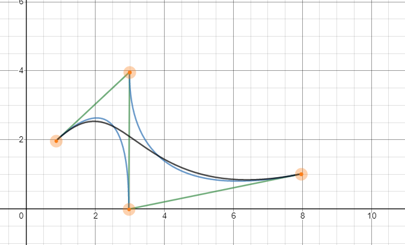

# 测试

1.  行内元素按照字体的 x 字符高度一半进行对齐; 行内块元素将自身的中点和 x 的高度一半进行对齐

2.  baseline font-size 区域的下边界

3.  position

    - static 默认值, 元素按照 normal flow 进行布局
    - relative 相对定位 元素原本的位置仍保留, 相对原本的位置进行偏移
    - absolute 绝对定位, 完全脱离文档流, 相对于最近的 position 属性值不为 static 的祖先元素进行偏移
    - fixed 固定定位, 相对于 viewport 进行定位

4.  border-box

5.  级联菜单

    - 将每级菜单嵌套进上一级菜单的菜单项元素中, 当鼠标 hover 菜单项时, 显示嵌套其中的下一级菜单

6.  ```html
    <div>
      <before></before>
      <h1>The article</h1>
      <p>the quick brown fox</p>
      <after></after>
    </div>
    ```

7.  ?
8.  缓动函数

    - 动画的运动曲线, 表示元素在整个动画中的速度变化
    - `run-in` `ease-in` `ease-out` `ease-in-out`
    - 使用贝塞尔曲线

9.  
10. 属性值是否以数值表示
11. ?
12. 显示上没有区别
13. ?

14. 中英互翻

- omit
- multiple 多个
- 驼峰式
- 中划线式 min-line
- layout 布局
- type 类型
- code review 代码检查
- 半径 radius
- config 设置
- 集合 set
- 矩形 regular
- binary 二进制
- decimal 十进制
- 十六进制 hex
- 八进制 octal
- SEO search engine option
- HTML 实体 HTML entity
- 语义化
- 兼容性
- quirk
- reference 表面
- 大小写敏感
- 别名

15. cotain: 80 cover: 40
16. 287px 189px
17. unary + - ! typeof binary + - \* / % > < == === != !== && || ^ & | 三元 ? :
18. !(!("")) ""
19. [小米返回动画](https://codepen.io/rabbitinhat/pen/MMpWzL)
20. 清除浮动: 给当前元素添加 clear 属性, 增加其外边距, 避开浮动元素; 闭合浮动, 通过触发 BFC, 添加伪元素等形式, 使包含浮动元素的父元素能够容纳浮动元素. 联系: 解决浮动元素脱离文档流, 造成的高度塌陷问题.
21. li 继承了默认的 font-size 和 line-height; 同时存在 list-style, 列表符号本质上是行内元素, 所以 list 的高度就为 18px; 此时 li 元素的高度+边框+外边距的总高度小于包含的 a 元素高度, 所以每行的 a 元素浮动时, 最左边仍然会遇到上一个 li 元素中浮动的 a 元素, 所以 a 就会像右移; 产生当前的渲染结果
22. 将页面中的所有图标图片集中在一整张图片上, 使用时, 通过 background-position 进行定位; 为什么使用: 页面载入时, 每个单独的图片都会触发浏览器下载, 增加页面载入的时间. 优点: 减少浏览器下载行为; 缺点: 需要单独计算每个图片的位置
23. 具有块元素属性的行内元素; 可以设置宽高, 默认情况下, 行内块的下边缘和每一行的基线对齐. 行内块高度大于当前行高时, 行高会被撑大. 为行内块设置 vertical-align: middle 时, 行内块会将中点和该行的 x 字符中点进行对齐
24. 后代元素会继承 color 属性 text-decoration, border 都会继承 color 属性值
25. ? em 框 字体中 x 字符的大小,不同字体大小不同; 行内框, 宽度由左右外边距, 边框, 内边距和文本宽度决定, 高度由行高决定, 行高由每行最高的行内元素, 行内块元素决定 行框由每行行高和每行宽度决定; 内容区默认由元素的包含内容确定, 默认情况下, width, height 设置的是内容区宽高, 通过改变 box-sizing, 会改变盒模型状态, 也会改变内容区宽高;
26. ?
27. baseline: 小写字母 x 的底端; 最高点: vertical-align: top; 最低点: vertical-align: bottom
28. table{caption, thead{tr{th}}, tbody{tr{td}}, tfoot{tr{td}}}
29. css:
    1.  hover 前的空格
    2.  style 标签, type="stylesheet"
    3.  opacity: 属性值为小数 结尾`;`
    4.  transition 无法影响 opacity 属性
    5.  不要在伪类中添加影响布局的属性;
    6.  a 闭合标签, href="" url
30. 45px
31. vertical-align: baseline; 行内元素按照baseline排列, 部分字母可能会超出baseline; 行内块元素底端对齐baseline
32. ?
33. 闭合浮动
    1.  使用伪元素, 并设置`clear:both`清除浮动, 这个方式会伪元素避开浮动元素; 撑起父元素的高度
    2.  父元素设置 overflow: hidden; 触发BFC, 使其可以包含浮动元素
    3.  父元素内额外添加一个元素, 设置其高度为0, `clear:both` 从而撑起父元素

34. ?
35. display: block 块元素 inline, inline-block 文本行
36. 默认情况下, 页面中元素按照从右向左, 从上到下的顺序排列; 包含块概念?
37. ?
38. 都是以同类型元素进行查找
39. background
    1.  background-image: url(); 背景图片
    2.  background-color: 背景颜色
    3.  background-position: left top center right bottom 背景定位, 50% 指的是背景图片的50%位置和元素的50%位置对齐
    4.  background-size: contain/cover ?
    5.  background-repeat: repeat-x/repeat-y/no-repeat 背景重复, 沿x轴/y轴重复

40. box-shadow: 0px 3px 0px 0px #333;
41. `visibility: hidden` `display: none` `opacity: 0`
    1.  `visibility: hidden` 仍然存在, 只是不可见
    2.  `display: none` 不存在于normal flow中
    3.  `opacity: 0` 元素内容透明度也会减少

42. `:checked` `:focus` `:validity` `:invalidity`
43. ?
44. block inline-block inline run-in flex grid flex-item
45. ??
46. `background: url(https://s01.mifile.cn/i/mi-home.png) no-repeat left 5px bottom 5px;`
47. 将该`td`元素和对应的`th`元素绑定起来
48. ```mkdir a, cd a, touch readme.md, mkdir foo, cd foo, mkdir c, cd.., mkdir bar, cd bar, mkdir y, touch a.txt, touch b.txt, cd y, touch a.js```
49. `https://test.example.com/path.css`
50. [animation实现marquee](https://codepen.io/rabbitinhat/pen/NZjNYq)
51. [多列等高(flex)](https://codepen.io/rabbitinhat/pen/XLRMaW)
52. 保留从左到右, 从上到下的边框
53. `ease ease-in ease-out ease-in-out liear` ?
54. 虚框(outline) `outline: none` tabindex: 1
55. IE hack vendor prefix 条件注释
    1.  IE hack 对于旧版本的IE浏览器, 通过条件注释等手段, 添加可以被IE浏览器兼容的CSS样式, HTML元素等. 实现
    2.  ??
    3.  `<!-if IE9-> <!-end->` 针对旧版本IE浏览器, 提高兼容性
56. `cm` `mm` 等是绝对单位, 宽度是物理尺寸, 对于页面布局来说不够灵活;
57. `sigma(0, infinite, (mul(division(pow(-1, n), factorial(add(mul(2, n), 1))), pow(x, add(mul(2, n), 1)))))`
58. 使用16进制编码表示特殊的图标
    1.  优点: 为字体, 可以接受字体相关样式, 使用灵活
    2.  缺点: 字体文件较大? 需要单独的字体文件, 可能会降低页面载入速度
59. viewport ?
    1.  不同浏览器环境?
    2.  `<meta name="viewport" content="width=1000px">`
    3.  `<meta name="viewport" content="width=device-width">`

60. `FOUC` `FOUT` ?
61. ?
62. `resize: none`
63. css shapes?
64. reflow: 回流 布局发生改变时, 浏览器会重新刷新页面, 重新载入页面
    1.  repaint: 重绘, 元素尺寸发生改变时, 浏览器发生repaint, 会产生抖动效果; reflow会触发repaint, repaint不一定会触发reflow(?)
65. 具体设置之外的元素属性发生改变也会触发transition
66. 整个动画效果分为10步完成, 每一步之间没有时间间隔(?)
67. colum-cros(?)
73. selector
    1.  作为父元素的第一个子元素
    2.  作为父元素中唯一一个该类型的子元素
    3.  作为父元素中第一个该类型的子元素
    4.  作为父元素中最后一个该类型的子元素
    5.  作为父元素中第n个该类型的子元素
    6.  作为父元素中倒数的第n个该类型的子元素
    7.  不包括某个元素
    8.  选中的`type=checkbox/radio`的input元素
    9.  具有disabled属性的input元素
    10. `enabled`
    11. 输入有效值的input元素
    12. 输入无效值的input元素
    13. `selection`
74. 错误
    1.  line 1 最外层`(`缺少`)`
    2.  `3 * (`
    3.  line 1 结尾应为`;` 或第二行不加`var`
    4.  line 2 foobar undefined/ "foobar"
    5.  line 9 `>=`
    6.  line 11 `<=`
    7.  line 13 `else if`缺少判断条件
    8.  两个`else`语句

75. 
```js
  function isLeapYear(year) {
  if((year % 4 === 0 && year % 100 !== 0) || (year % 400 === 0 && year % 3200 !== 0)){
    console.log("YES")
  } else {
  console.log("No")
  }
}
```
76. ??
77. 13
78. ?
79. 
